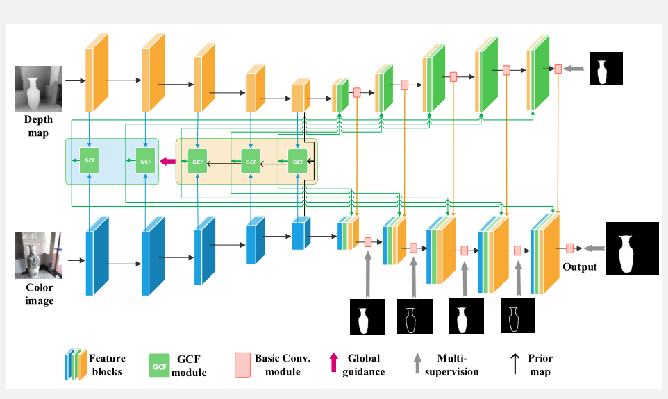

# [Global-prior-guided fusion network for salient object detection](https://www.sciencedirect.com/science/article/pii/S0957417422002639)

## Introduction
* Network:
    * global fusion
    * global cross modality fusion 

## Dependence

* ubuntu
* pytorch 1.7 (other versions may also work)
* numpy, opencv3, tqdm
* [apex](https://github.com/NVIDIA/apex) for efficient training

## How to train
1. prepare your training datasets:
    * we followed [A2dele](https://github.com/TuesdayT/CVPR2020-A2dele) and adopted their training dataset. 
    * [Download Link](https://pan.baidu.com/share/init?surl=4cGEwcCRulWDOuKNIjuGCg); Fetch Code: 0fj8
2. set your paths in ``train_cross.py``
3. run ``train_cross.py``

## How to test
1. prepare your test datasets. (Most of them are collected in [RGBD-SOD survey](https://github.com/taozh2017/RGBD-SODsurvey))
3. download the **model** from [baiduyun](https://pan.baidu.com/s/1WssiPgaJcZ02AI3OoEuF4w),(fetch code: peng) and put in the root dir
4. run ``test_cross.py``.

## How to visualize feature maps
1. put your images and depth images into ``vis_feature.test_data``.
2. set the ``VisualizationDemo.py`` to get your intersted feature maps.
3. enjoy!

## Results
* [Baduyun Result Link](https://pan.baidu.com/s/1edLCHGd9RA6YyJa8vuYAng); Fetch code: peng
* 百度网盘链接：https://pan.baidu.com/s/1edLCHGd9RA6YyJa8vuYAng .
提取码：peng 

## Evaluation

* Recommend [SOD_Evaluation_Metrics](https://github.com/zyjwuyan/SOD_Evaluation_Metrics)

## Acknowledgement
* [our website](https://www.neuro.uestc.edu.cn/vccl/publications.html)
* [SOD_Evaluation_Metrics](https://github.com/zyjwuyan/SOD_Evaluation_Metrics)
* [A2dele](https://github.com/TuesdayT/CVPR2020-A2dele)
* [RGBD-SOD survey](https://github.com/taozh2017/RGBD-SODsurvey)
